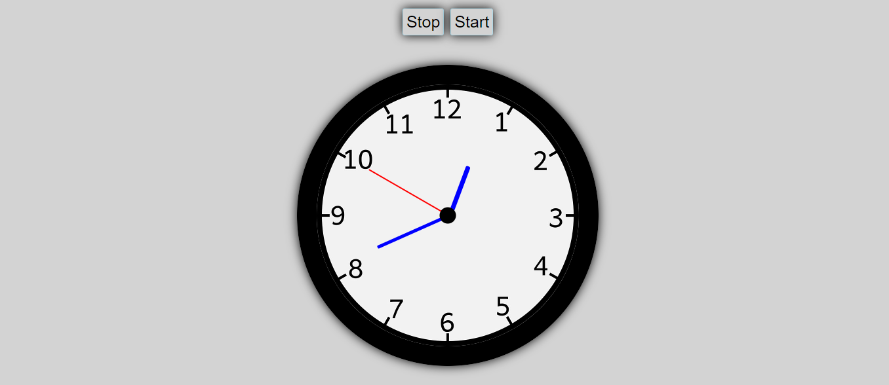

# analog-clock
An analog clock made using JS, CSS and HTML. It has stop and start button to stop the clock at anytime and again start it. The stop button will stop the clock from moving and the start button will start the clock from the current time.

